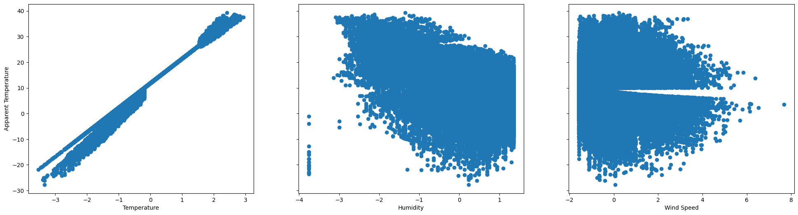
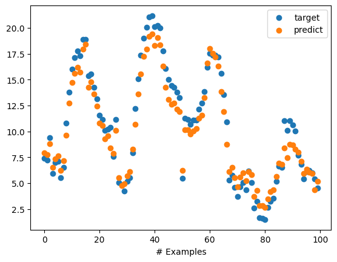
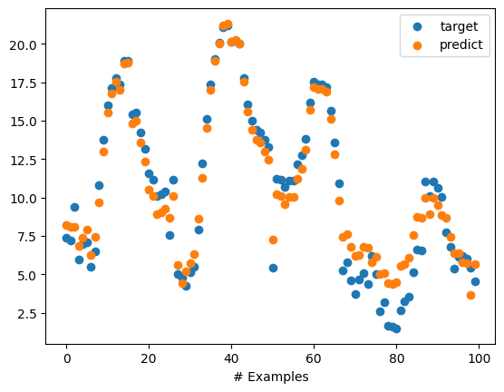

# szeged-weather-linear-regression

## Relationship of Features with Apparent Temperature
The substantial variability in target values prompted me to develop a model excluding Humidity and Wind Speed.

## Plotting Target and Prediction
Following plots illustrate the first 100 examples from the dataset.

Enhanced accuracy is achieved by incorporating Humidity and Wind Speed alongside Temperature in the model.
### Temperature, Humidity and Wind Speed
Total Cost: 0.58307019

### Temperature
Total Cost: 0.84861941

